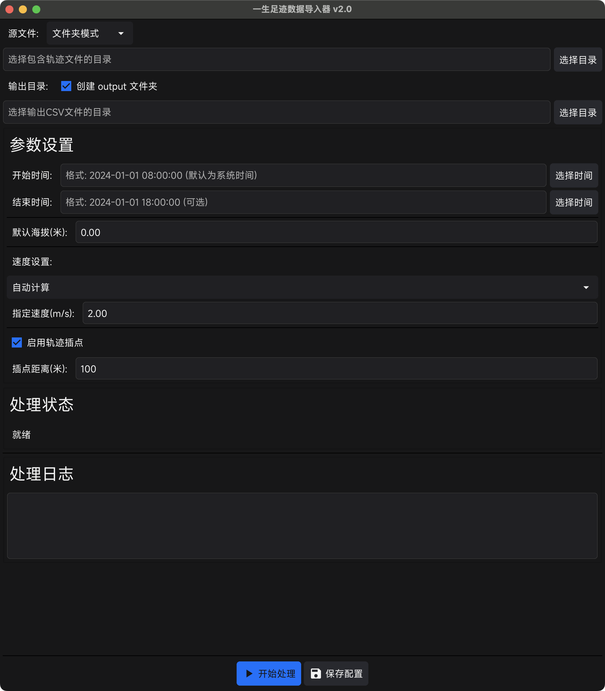

<p align="center">
  <strong>用最快的方式，将三方数据轨迹导入到「一生足迹」中</strong>
</p>

<h1 align="center">一生足迹数据导入器GUI版</h1>

<p align="center">
  <a href="https://github.com/Kearney3/steplife-universal-importer-gui/releases">
    
  </a>
  <a href="https://github.com/Kearney3/steplife-universal-importer-gui/blob/main/LICENSE">
    
  </a>
  <a href="https://github.com/Kearney3/steplife-universal-importer-gui">
    
  </a>
</p>

---

## 📖 项目简介

**一生足迹数据导入器** 是一个便捷的数据转换工具，支持将第三方轨迹数据（奥维互动地图、KML、GPX 等）快速转换为一生足迹 App 所需的 CSV 格式，帮助你更完整地记录旅途与人生的点点滴滴。

> 🙏 **致谢**：本项目基于 [hygao1024/steplife-universal-importer](https://github.com/hygao1024/steplife-universal-importer) 开发，感谢原作者的贡献。

---

## 💡 为什么需要这个工具？

### 关于「一生足迹」

> 你好，我是足迹的开发者。  
> 2017 年的清明节（17.4.4），我和同事去了一次沙漠，徒步 12 小时，25.7 公里，我们穿越了中国第七大沙漠库布其。这次旅行很累，也让我记忆深刻。  
> 在回北京的路上有人在群里问，我们是从哪儿走到哪儿的？可遗憾的是，没有一个人能准确说出。  
> 突然我就感觉挺悲哀的。也许我的一生也会这样，不管经历多少，遭遇了多少，到最后，都会被淡忘。没有人记得我们的过去。就像我们这次的旅行一样，很快就会被忘记。  
> 所以，我写了这个可以记录一生轨迹的 APP。  
> —— By 足迹开发者

这是一款专注于个人轨迹记录的 App。多次获得 Apple App Store 推荐，数据完全保存在本地，无服务器、无广告、隐私安全可靠。

### 使用场景

虽然一生足迹的开发者在耗电控制与定位漂移优化方面做了大量努力，但在某些极端环境下，仍可能出现记录不完整的问题：

- 🚄 **高铁出行**：信号差导致轨迹中断
- ✈️ **飞机出行**：GPS 信号受限，轨迹缺失
- 🏔️ **沙漠深山**：GPS 不稳定，定位不准确
- 🔋 **手机电量不足**：自动停止记录
- 📱 **应用未启动**：忘记开启记录功能

为了解决这些特殊场景下的记录缺失问题，「数据导入器」应运而生。

---

## ✨ 核心特性

### 数据格式支持

- ✅ **奥维互动地图**：支持 Omap JSON 格式导入
- ✅ **KML 格式**：支持标准 KML 文件格式
- ✅ **GPX 格式**：支持标准 GPX 文件格式
- ✅ **一键转换**：快速转换为一生足迹所需的 CSV 格式

### 功能特性

- 🎨 **全新 GUI 界面**：直观易用，支持实时参数调整
- 📦 **批量文件处理**：支持文件夹内多文件自动处理
- ⏰ **智能时间分配**：支持设置开始时间、结束时间和时间间隔，灵活控制轨迹时间戳
- 🌍 **时区选择**：支持选择常用时区，确保时间戳解析准确
- 🏔️ **海拔高度控制**：支持自定义默认海拔
- 🚀 **速度计算引擎**：自动计算或手动指定速度
- 🔒 **隐私安全**：无需联网，数据完全本地处理

---

## 🚀 快速开始

### 方式一：下载预构建版本（推荐）

访问 [Releases 页面](https://github.com/Kearney3/steplife-universal-importer-gui/releases) 下载最新版本。

**支持的平台：**
- Windows (amd64, arm64)
- macOS (amd64, arm64)
- Linux (amd64, arm64)

> 💡 **提示**：所有版本均由 GitHub Actions 自动构建和发布，确保构建的一致性和可靠性。

### 方式二：从源码构建

**环境要求：**
- Go 1.24.2 或更高版本
- 支持的操作系统：Windows、macOS、Linux

**构建步骤：**

```bash
# 克隆项目
git clone https://github.com/Kearney3/steplife-universal-importer-gui.git
cd steplife-universal-importer-gui

# 下载依赖
go mod tidy

# 构建（默认嵌入字体到可执行文件）
go build -tags=embed_font -o main ./cmd
```

**或使用构建脚本：**
- Linux/macOS: `./build.sh` 或 `./build_macos.sh`（macOS）
- Windows: `build.bat`


### 运行方式

双击运行 `main`（macOS/Linux）或 `main.exe`（Windows），启动图形界面进行操作。

---

## 🎯 使用指南

### GUI 界面使用

启动程序后，将打开图形用户界面：

#### 1. 选择文件目录

- 点击"源文件目录"右侧的"选择目录"按钮
- 选择包含轨迹文件的目录（支持 KML、GPX、Ovjsn 格式）

#### 2. 设置输出目录

- 点击"输出目录"右侧的"选择目录"按钮
- 选择 CSV 文件保存目录（可选，默认保存到源文件目录）

#### 3. 配置参数

**时间设置：**
- 开始时间：设置轨迹起始时间（格式：`2024-01-01 08:00:00`）
- 结束时间：设置轨迹结束时间（可选，用于精确时间分配）
- 时间间隔：设置相邻轨迹点之间的时间间隔（秒，可选，支持负数）
- 时区：选择时区用于解析时间字符串（可选，默认使用系统本地时区）
  - 支持常用时区：UTC、中国（北京时间）、日本、香港、新加坡、美国东部/西部/中部、英国、法国、德国、澳大利亚等
  - 选择"系统本地时区"将使用运行环境的本地时区
- **时间分配优先级**：
  1. 如果设置了结束时间，系统会在开始和结束时间之间均匀分配时间戳
  2. 如果设置了时间间隔，系统会按照指定间隔分配时间（负数会反转时间顺序）
  3. 如果都没有设置，所有时间统一为开始时间

**海拔设置：**
- 设置默认海拔高度（单位：米）

**速度设置：**
- 选择"自动计算"或"手动指定"
- 手动指定时可设置固定速度值（m/s）

**插点设置：**
- 启用/禁用轨迹插点功能
- 设置插点距离阈值（米）

#### 4. 开始处理

- 点击"开始处理"按钮执行转换
- 界面会显示处理进度和状态信息

#### 5. 保存配置

- 点击"保存配置"按钮将当前设置保存到配置文件

**批量处理特性：**
- GUI 界面支持批量处理，会自动扫描目录内所有支持的文件
- 每个源文件会生成对应的 CSV 文件，文件名格式：`原文件名_steplife.csv`
- 处理过程中会显示实时进度和状态信息
- 如果输出文件已存在，会自动覆盖（不会追加内容）

---

## ⚙️ 高级配置

### 轨迹精度优化

为了增强轨迹的连贯性和可视效果，本项目在处理第三方轨迹数据时内置了轨迹补点算法。

**功能说明：**
- 当轨迹中相邻两个点之间的距离超过设定的阈值（默认 100 米）时，程序会自动插入补点，使得轨迹在地图上更为平滑
- 该功能特别适用于高铁、飞机等定位信号间断较长的场景
- 默认情况下，插点策略是启用的

> 📌 **提示**：插值点将采用直线插值方式生成，确保轨迹在地图上的视觉连续性，但不会对原始数据精度产生影响。

### 时间设置

支持三种灵活的时间分配模式，用于精确控制轨迹的时间戳。

#### 时区选择

程序支持选择时区来解析时间字符串，确保时间戳的准确性。

**功能说明：**
- 提供 14 个常用时区选项，包括：
  - 系统本地时区（默认）
  - UTC (协调世界时)
  - 中国 (北京时间)
  - 日本 (东京)
  - 香港
  - 新加坡
  - 美国东部 (纽约)
  - 美国西部 (洛杉矶)
  - 美国中部 (芝加哥)
  - 英国 (伦敦)
  - 法国 (巴黎)
  - 德国 (柏林)
  - 澳大利亚 (悉尼)
  - 澳大利亚 (墨尔本)
- 如果配置文件中包含其他时区，程序会自动识别并显示为"自定义时区"
- 时区设置会影响时间字符串的解析，选择正确的时区可确保时间戳准确

**使用建议：**
- 如果输入的时间是本地时间，选择对应的时区
- 如果输入的时间是 UTC 时间，选择 "UTC (协调世界时)"
- 如果不确定，使用"系统本地时区"（默认选项）

#### 时间分配模式（按优先级）

1. **结束时间模式**（优先级最高）
   - 如果同时设置了开始时间和结束时间，系统会在两者之间均匀分配时间戳
   - 确保最后一个点的时间戳等于结束时间
   - 示例：开始时间 `2024-01-01 08:00:00`，结束时间 `2024-01-01 18:00:00`，系统会自动计算间隔

2. **时间间隔模式**
   - 如果设置了时间间隔，系统会按照指定间隔递增（或递减）分配时间戳
   - 正数：时间戳递增（如间隔为 1 秒：100, 101, 102, ...）
   - 负数：时间戳递减，实现时间顺序反转（如间隔为 -1 秒：100, 99, 98, ...）
   - 示例：开始时间 `2024-01-01 08:00:00`，时间间隔 `5`，每个点间隔 5 秒

3. **统一时间模式**（默认）
   - 如果都没有设置，所有轨迹点的时间戳统一为开始时间
   - 适用于不需要时间序列的场景


### 海拔高度设置

设置轨迹点的默认海拔高度。

**功能说明：**
- 所有轨迹点将使用设置的默认海拔高度值（单位：米）


### 速度设置

控制轨迹中每个点的速度信息。

**功能说明：**
- 支持两种速度计算模式：
  - **自动计算**：根据轨迹点间距离自动估算速度
  - **手动指定**：使用固定的速度值（m/s）


---

## 📥 数据导入指南

### 导入奥维互动地图数据

> **奥维互动地图**，专业地理规划软件  
> 跨平台地图浏览器，支持 iOS (iPhone、iPad)、Android、Windows、macOS、Linux 等流行平台。  
> 拥有强大的设计功能与地理信息展现技术，可满足各行各业地理信息规划的需求。

#### 操作步骤

**Step 1.** 下载奥维互动地图应用

访问下载地址：https://www.ovital.com/download/

**Step 2.** 创建轨迹

打开奥维互动地图应用，输入起点终点，选择你的路线后并双击，转换成轨迹并保存。


**Step 3.** 导出轨迹

点击左下角收藏夹，选中你的轨迹进行导出，**导出格式请务必选择 `ovjsn格式(奥维json格式)`**。


**Step 4.** 运行转换工具

启动软件，在源文件选择包含轨迹文件的文件夹或文件。



**Step 5.** 导入到一生足迹

程序会生成 CSV 文件（文件名格式：`原文件名_steplife.csv`），将文件导入手机中，打开选择一生足迹 App，即可完成数据录入。

---

### 导入 KML、GPX 数据

> **KML**（Keyhole Markup Language）是一种基于 XML 的文件格式，用于描述地理空间数据。它最初由 Keyhole 公司开发，后被 Google 收购并广泛应用于 Google Earth 等地理信息系统中。  
> 
> **GPX**（GPS eXchange Format, GPS 交换格式）是一个 XML 格式，为应用软件设计的通用 GPS 数据格式。它可以用来描述路点、轨迹、路程。这个格式是免费的，可以在不需要付任何许可费用的前提下使用。

#### 操作步骤

**Step 1.** 获取 KML/GPX 数据

你可以从各类地图软件中获取 KML/GPX 数据。

**Step 2.** 运行转换工具

双击运行程序，使用 GUI 界面选择包含 KML/GPX 文件的目录。

**Step 3.** 导入到一生足迹

程序将生成 CSV 文件，可在手机中导入至一生足迹 App。


---

## 📁 项目结构

```
steplife-universal-importer-gui/
├── cmd/
│   └── main.go                    # 主程序入口
├── internal/
│   ├── const/                     # 常量定义
│   ├── gui/                       # GUI 界面
│   │   ├── resources/             # 资源文件（字体、图标等）
│   │   │   ├── MiSans-Regular.otf # 字体文件
│   │   │   ├── icon.png           # 图标文件
│   │   │   └── icon.ico           # Windows 图标
│   │   ├── font_embed.go          # 嵌入字体模式
│   │   ├── font_file.go           # 文件系统字体模式
│   │   └── main.go                # GUI 主程序
│   ├── model/                     # 数据模型
│   ├── parser/                    # 数据解析器（GPX、KML、Ovjsn）
│   └── utils/                     # 工具函数
├── source_data/                   # 源数据目录（示例文件）
├── output/                        # 输出目录
├── static/                        # 静态资源（图片、视频等）
├── build.sh                       # Linux/macOS 构建脚本
├── build_macos.sh                 # macOS .app 构建脚本
├── build.bat                      # Windows 构建脚本
└── README.md                      # 项目说明文档
```

---

## 📝 注意事项

- ✅ 请确保文件格式正确，命名规范，以便程序正常识别
- ✅ 默认构建会将字体嵌入到可执行文件中，无需额外的资源文件
- ✅ 如有问题或建议，欢迎提交 [Issue](https://github.com/Kearney3/steplife-universal-importer-gui/issues) 或者 [PR](https://github.com/Kearney3/steplife-universal-importer-gui/pulls)

---

## 🚢 版本发布

本项目使用 GitHub Actions 进行自动化构建和发布：

- **自动构建**：当推送以 `v` 开头的标签（如 `v2.0`）时，会自动构建所有平台的可执行文件
- **自动发布**：构建完成后会自动创建 GitHub Release 并上传所有平台的发布包
- **多平台支持**：同时支持 Windows、macOS、Linux 的 amd64 和 arm64 架构

查看 [Actions 页面](https://github.com/Kearney3/steplife-universal-importer-gui/actions) 了解构建状态。

---

## 🙏 致谢

- 感谢 [hygao1024/steplife-universal-importer](https://github.com/hygao1024/steplife-universal-importer) 原作者的贡献
- 感谢每一位愿意记录人生、珍视记忆的你

如果你觉得项目有帮助，请点个 Star ⭐️！

**仓库地址**：https://github.com/Kearney3/steplife-universal-importer-gui

---

<p align="center">
  Made with ❤️ for preserving life memories
</p>
